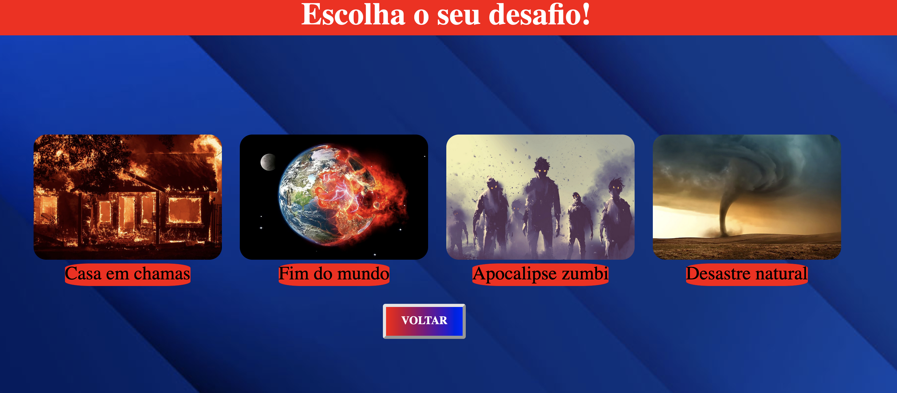
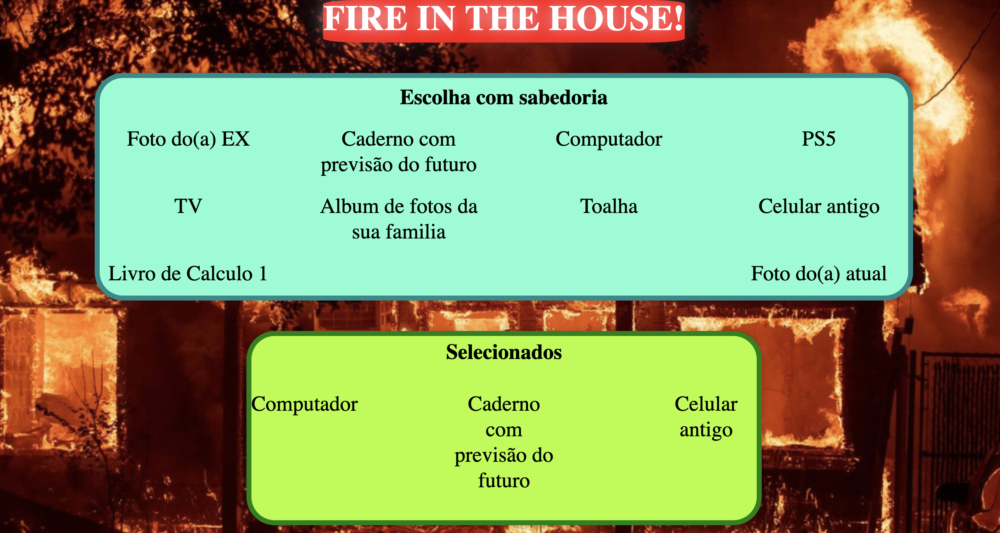
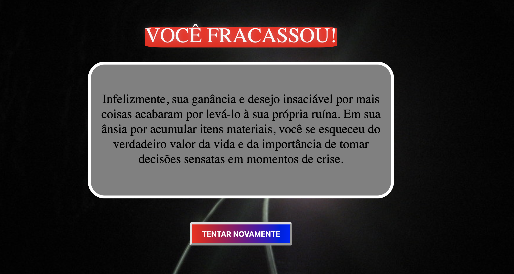

# PD_SOBREVIVA!

**Número da Lista**: 30 <br>
**Conteúdo da Disciplina**: Programação Dinâmica <br>

## Alunos
|Matrícula | Aluno |
| -- | -- |
| 20/2028211  |  Antônio Aldísio de Sousa Alves Ferreira Filho |
| 19/0048221  |  Rodrigo Balbino Azevedo de Brito |

## Sobre

Este projeto é uma aplicação web desenvolvida usando Vue.js onde o usuário é colocado em diferentes cenários e precisa escolher um conjunto de itens para sobreviver, dessa forma o algoritmo knapsack define a sobrevivência do usuário de acordo com a quantidade de itens.

## Screenshots








## Instalação
**Linguagem**: Javascript <br>
**Framework**: Vue.js <br>

## Uso

Para instalar os pacotes necesario, vá até sua raíz e use o comando:

```
$ make install
```

Para a execução do projeto, vá até sua raíz e use o comando:
```
$   make run
```
